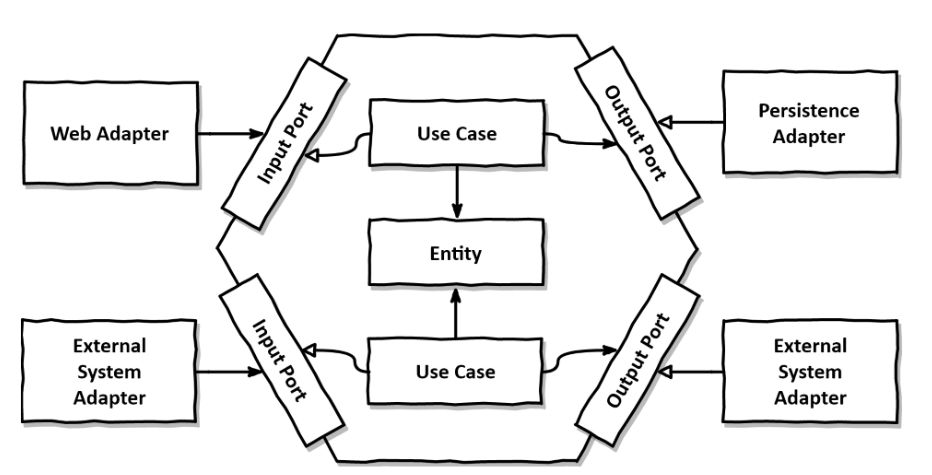

# TP MIAGE conception logicielle

## Nom du(des) étudiant(e)(s) de ce monôme/binôme 
WARNING: NE PAS OUBLIER DE MENTIONNER LES DEUX NOMS SI VOUS ETES EN BINOME!

#CHEVALET Romain # et #GIBELOT Mael#)

Commentaires éventuels des étudiants : #XXXXXX#

## Pré-requis 

* Disposer d'un PC d'au moins 8 Gio de RAM avec 20 Gio de disque disponible ; Un PC par binôme suffit, choisir le plus puissant (avec le plus de RAM).
* Disposer d'une connexion internet hors université pendant le TP (le réseau de l'université semble bloquer un certain nombre de choses). En cas d'urgence, je peux fournir de la data.
* Disposer d'un compte Github par personne (ou un pour deux personnes si vous êtes en binôme) et avoir https://docs.github.com/en/authentication/keeping-your-account-and-data-secure/creating-a-personal-access-token[créé un access token] avec le droit `repo`;

## Environnement de développement

Deux options sont possibles :

### Option 1 [préférée] - Utiliser la VM fournie

Télécharger, décompresser et *tester* cette https://public.florat.net/cours_miage/vm-tp-miage.ova[image VirtualBox] *avant le TP*. Elle contient tous les outils nécessaires (Intellij IDEA, DBeaver, client REST Insomnia, Firefox...).

Le login/mot de passe est : `vagrant`/`vagrant`.

IMPORTANT: Si pas déjà fait, activer les fonctions de virtualisation CPU dans votre BIOS/UEFI (option `AMD-V` ou `Intel VT` en général) sinon votre VM sera extrêmement lente et inutilisable. Une version récente de VirtualBox est également nécessaire.

### Option 2 - Installer les outils soit même sur votre machine

* Disposer d’un IDE (de préférence Intellij IDEA CE, Eclipse ou VSCode) supportant le Java et Maven.
* Disposer d’une installation de Docker.
* Disposer d’un client de test REST (Insomnia ou Postman conseillés).
* Disposer d’un explorer de base de donnée (DBeaver conseillé).

## Déroulement du TP

* Répondre aux questions de la feuille de TP juste sous la question (en modifiant, commitant puis poussant le fichier `README.adoc`).

Nous fournissons différents projets IDEA servant de base de travail aux exercices suivant. Cela permet un point de synchronisation de tous les étudiants à différents moments du TP.

IMPORTANT: Vous ne pourrez pas faire de `push` avec votre mot de passe (Github n'autorise plus que les access tokens), veuillez utiliser login/<access token> (voir pré-requis plus haut pour le créer).

### Exercice 1 - Etudier une API REST sans couches
_Temps estimé : 40 mins_

* Importer dans IDEA les projets depuis le VCS (URL : `https://github.com/<x>/tp-miage-2024.git`.

TIP: [Rappel Git] Trois dépôts sont ici utilisés : le dépot Github de l'enseignant (`bflorat/tp-miage-2024`), le dépot Github du binôme (`<x>/tp-miage-2024`), le dépot local sur le portable de l'un ou des deux étudiants du binôme.

* Observer le code du projet `todolist-debut-ex1`

*Le code est-il structuré en couches ? Quel problèmes ce code peut-il poser ?*

- Le projet todolist-debut-ex1 est structuré autour d'un modèle MVC simplifié, (contrôleur et modèle)
avec une séparation entre le contrôleur (TodoListController) et la persistance des données (TodoItemRepository).
Couplage entre les couches : Les couches sont étroitement couplées, ce qui peut rendre les modifications dans une couche susceptibles d'affecter les autres.
Par exemple, un changement dans la structure de TodoItem pourrait nécessiter des modifications dans le contrôleur et le repository.
Cependant, la logique métier, en particulier la règle de gestion RG 1 (ajout de "[LATE!]" pour les items en retard), est implémentée directement dans le contrôleur.
Intégrer les règles de gestion directment dans le controleur des endpoints rend le code moins facilement testable et plus compliqué à maintenir.
- #


*Où se trouve le code métier (voir la règle de gestion RG 1) ?*
- Dans le contrôleur (TodoListController) : la méthode finalContent.

*Cette règle est-elle facilement testable par un test unitaire ?*
- Elle est testable en théorie, mais elle aurait été plus simple à tester si elle avait été isolée dans une couche service par exemple. (Testable via une autre méthode : todoItems)
Pour autant elle reste très facile à tester en tests réels avec une requête Postman ou Insomnia.

* Lancer une base PostgreSQL en Docker dans un terminal (on lance ici la base en mode interactif pour visualiser son activité. Pour la lancer en tâche de fond, remplacer les options `it` par `d` comme 'daemon'):
```bash
docker run -it -e POSTGRES_PASSWORD=password -p 5432:5432 postgres
```
*Expliquer cette ligne de commande (y compris les options utilisées)*
- La commande docker run -it -e POSTGRES_PASSWORD=password -p 5432:5432 postgres lance une instance Docker du serveur PostgreSQL avec plusieurs options :
    - it : Exécute le conteneur en mode interactif (i) et alloue un pseudo-TTY (t), permettant d'interagir avec le conteneur via le terminal.
    - e POSTGRES_PASSWORD=password : Définit une variable d'environnement (-e) pour spécifier le mot de passe de l'utilisateur postgres dans le conteneur, ici password.
    - p 5432:5432 : Publie le port (-p) du conteneur (5432, standard pour PostgreSQL) sur le même port de l'hôte, permettant d'accéder au serveur PostgreSQL depuis l'hôte.
    postgres : Spécifie l'image Docker à utiliser, ici l'image officielle postgres.

* Compléter le code manquant dans la méthode `TodoListController.createTodoItem()`

*Pourquoi `todoItemRepository` est-il `null` ? Quelle est la meilleure façon de l'injecter ?*
- Dans le TodoListController, nous avons deux constructeurs : un qui accepte un TodoItemRepository comme argument et un constructeur par défaut sans arguments.
Le problème avec cette approche est que Spring ne va injecter TodoItemRepository que si l'on utilise l'injection de dépendances via le constructeur,
ce qui signifie que nous devons supprimer le constructeur par défaut pour forcer l'utilisation du constructeur avec le paramètre TodoItemRepository.
Lorsque le constructeur par défaut est présent et utilisé par Spring, todoItemRepository restera null, ce qui entraîne une NullPointerException.

* Modifier le code en conséquence.

* Tester vos endpoints avec un client REST.


[NOTE]
====
* Les URL des endpoints sont renseignées dans le contrôleur via les annotation `@...Mapping` 
* Exemple de body JSON : 

```json
{
    "id": "0f8-06eb17ba8d34",
    "time": "2020-02-27T10:31:43Z",
    "content": "Faire les courses"
  }
```
====

NOTE: Pour lancer l'application Spring, sélectionner la classe `TodolistApplication` et faire bouton droit -> 'Run as' -> 'Java Application'.

* Quand le nouveau endpoint fonctionne, commiter, faire un push vers Github.

* Vérifier avec DBeaver que les données sont bien en base PostgreSQL.

### Exercice 2 - Refactoring en architecture hexagonale
_Temps estimé : 1 h 20_

* Partir du projet `todolist-debut-ex2`

NOTE: Le projet a été réusiné suivant les principes de l'architecture hexagonale : 


Source : http://leanpub.com/get-your-hands-dirty-on-clean-architecture[Tom Hombergs]

* Nous avons découpé le coeur en deux couches : 
  - la couche `application` qui contient tous les contrats : ports (interfaces) et les implémentations des ports d'entrée (ou "use case") et qui servent à orchestrer les entités.
  - la couche `domain` qui contient les entités (au sens DDD, pas au sens JPA). En général des classes complexes (méthodes riches, relations entre les entités)

*Rappeler en quelques lignes les grands principes de l'architecture hexagonale.*
- L'architecture hexagonale vise à séparer le cœur d'une application (sa logique métier) de ses services périphériques (comme la base de données, le système de fichiers, etc.).
Cette séparation est réalisée en définissant des "ports", qui sont des interfaces pour les fonctionnalités core, et des "adaptateurs", qui connectent ces ports aux technologies extérieures.
L'objectif est de permettre à l'application de rester indépendante de ses technologies externes, facilitant ainsi les tests, la maintenance et l'évolution de l'application.

Compléter ce code avec une fonctionnalité de création de `TodoItem`  persisté en base et appelé depuis un endpoint REST `POST /todos` qui :

* prend un `TodoItem` au format JSON dans le body (voir exemple de contenu plus haut);
* renvoie un code `201` en cas de succès. 

La fonctionnalité à implémenter est contractualisée par le port d'entrée `AddTodoItem`.

### Exercice 3 - Ecriture de tests
_Temps estimé : 20 mins_

* Rester sur le même code que l'exercice 2

* Implémenter (en junit) des TU portant sur la règle de gestion qui consiste à afficher `[LATE!]` dans la description d'un item en retard de plus de 24h.

*Quels types de tests devra-t-on écrire pour les adaptateurs ?* 
-Pour les adaptateurs, nous devrions écrire des tests d'intégration qui valident par exemple les RG métier.
Ces tests doivent évaluer la capacité des adaptateurs à faciliter la communication entre le cœur de l'application et les services externes, en s'assurant de la correcte transmission des données et de la gestion adéquate des erreurs,
tout en respectant les spécifications de l'application sur la logique métier comme dit précédemment, avec la gestion des tâches en retard.

*S'il vous reste du temps, écrire quelques-uns de ces types de test.*

[TIP]
=====
- Pour tester l'adapter REST, utiliser l'annotation `@WebMvcTest(controllers = TodoListController.class)`
- Voir cette https://spring.io/guides/gs/testing-web/[documentation]
=====


